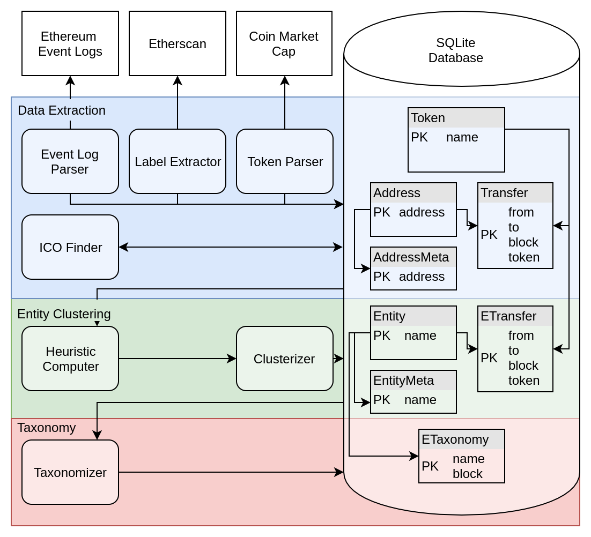

# Polonius: Entity Taxonomizer for Token Networks

> "Though this be madness, yet there is method in't."

Polonius is a blockchain analysis framework. It creates entity taxonomies out of raw blockchain data. In general, it follows a three step process. This setup corresponds with the setup presented in the Implementation chapter in the thesis.:
1. Data Extraction: Data is extracted from a raw data sources and written into an Address graph.
2. Entity Clustering: Applies heuristics to the address graph and then constructs and Entity graph
3. Taxonomy: Creates an entity taxonomy of the address graph at a specific blocknumber.


Step one and two are blockchain-specific. The taxonomy step is blockchain independent and can be reused for other blockchains. Polonius stores all data in a SQLite database and most logic is implemented as SQL commands. The SQL commands are triggered by Node.js scripts and data source scrapers are also implemented in Node.js.

Due to the scope of the work, only data extraction and entity clustering for ERC20 tokens are implemented. The individual scripts typically take between 15 minutes an several hours to finish on a machine with a lot of memory and and the database being on an SSD. Therefore, the scripts are often quicker to be adapated than to let the whole database rerun. 

## Getting Started

1. Install Node.js (tested with v12.4.0)
2. Install npm dependencies
```
npm i
```
3. Running individual analysis steps:

**On the data-extraction level**:

Token Parser:
```npm run extract:erc20:tokenParser```

EventLogParser:
```npm run extract:erc20:eventLogParser```

LabelExtractor
```npm run extract:erc20:labelExtractor```

ICOFinder:
```npm run extract:erc20:icoFinder```

**On the entity-clustering level**:

Heuristic Computer:
```npm run entityclustering:erc2:heuristicComputer```

Clusterizer:
```npm run entityclustering:erc2:clusterizer```

**And to compute the taxonomy**:
```npm run taxonomizer```

For validating if the installation worked, testing the Token Parser component is a good choice. The scripts on entity-clustering and taxonomy level start by dropping large tables and recalculating them which can be very time intensive.

## Project Structure

The three major steps correspond to the three folder `data-extraction`, `entity-clustering` and `taxonomy`. In `data-extraction` and `entity-clustering` the application logic lies in the folder `erc20`. Shared logic can be found in the util folder. The token-explorer component for analyzing the address graph can be found in the subfolder `tokenexplorer` and has a seperate readme file.

Data files are stored in the `data` folder. The most important file is `tokens.json` which maintains a list of all known token classes. The SQLite database is stored in `db/baltasar.db`. The `util` folder contains code which is reused. Most imporantly, `util/requireSQL` file allows the parsing of sql files with multiple scripts.

The `db-scripts` contains scripts which were used for smaller computations (e.g. calculation of the heuristics parameters in chapter 5). The jupyter folder contains juypter scripts which were used for analysis. The graphs in the thesis can be found in `jupyter/graphs`.
